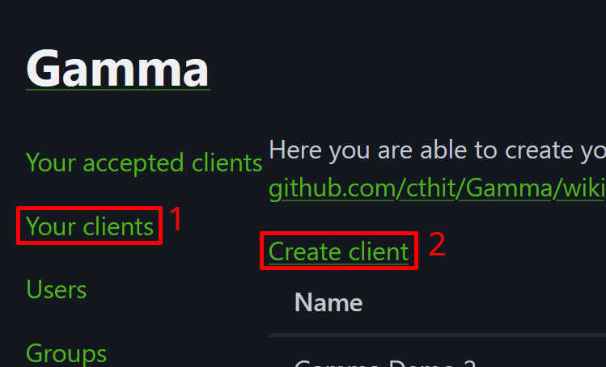
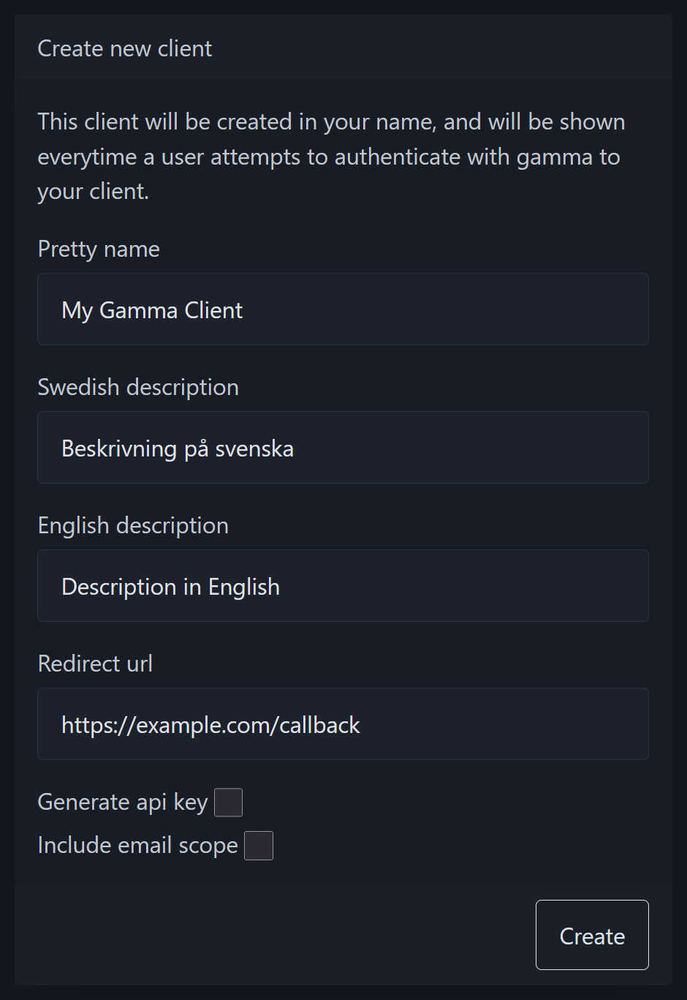
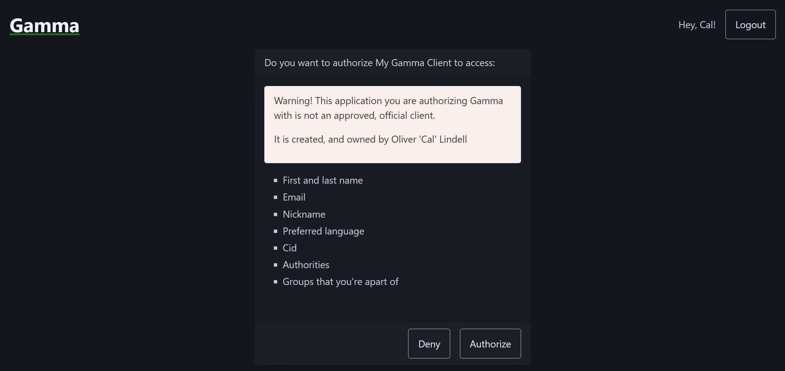

# Gamma Documentation

## About this Document

This document is is aimed at developers looking to use the Gamma API to
provide their users with the ability to login with Gamma or to fetch data from
the Gamma API in general.

It was written by Cal (Oliver Lindell) to demistify how to use and integrate
with Gamma after painstakingly figuring out how to do so without documentation.

### Contributing

Contributions to this document are welcome and much appreciated. Contact Cal or
digIT to find out how you can help.

### The Future

In the future this document will be hopefully be hosted on some official place
such as the GitHub wiki page for Gamma or on some *chalmers.it* website.

## Introduction

### What is Gamma?

Gamma is the authentication and authorization service developed and used by the
IT student division at Chalmers.

It is hosted at <https://auth.chalmers.it> and the source code can be found on
GitHub [here](https://github.com/cthit/Gamma).

## Getting Started with Gamma Clients

> NOTE TO SELF: This section will be about how to create your first client, what
> a client is and the different ways to authenticate with Gamma.

### What is a Client?

> TODO:

Gamma is built on top of the OAuth 2.0 protocol. A basic understanding of the
protocol is required to be able to follow this documentation.
[This article](https://auth0.com/intro-to-iam/what-is-oauth-2) by Auth0 serves
as a good introduction to the standard.

The "Gamma API" actually consists of 4 API:s with different use-cases:

- Client API
- Info API
- Allow List API
- Account Scaffold API

See [API Reference](#api-reference) for more details about the different API:s.

#### Official Clients

A user client can only do so much and only has access to the Client API and part
of the Info API. To do more you must be a Gamma administrator and create an
*official client*.

> [!NOTE]  
> As I (Cal) am not a Gamma administrator I have limited ability to test and
> document these features of Gamma.

### Creating your first Gamma Client

> [!IMPORTANT]  
> To create a client you must have a Gamma account, you can register yours
> [here](https://auth.chalmers.it/activate-cid). Detailed instructions can be
> found on [wikIT](https://wiki.chalmers.it/Gamma#HowTo:_Skapa_Gamma-konto).

After creating your Gamma account you can follow these steps to create your
first Gamma client:

1. Login to <https://auth.chalmers.it> with your Gamma account and go to the
   "**Your clients**" menu and click "**Create client**". Or go to
   <https://auth.chalmers.it/my-clients/create>.

   

2. Fill in your client details, here is an explanation of the different fields:

   | Field               | Description                                                                                                                                                                                                            |
   |---------------------|------------------------------------------------------------------------------------------------------------------------------------------------------------------------------------------------------------------------|
   | Pretty name         | The name that is shown to your users when authorizing your client. Look at the [authorization page](#the-authorization-page) for reference.                                                                            |
   | Swedish description | A short description in Swedish explaining what your client is for. Appears on the ["**Your accepted clients**"](https://auth.chalmers.it/me/accepted-clients) page for users with Swedish as their preferred language. |
   | English description | A short description in English explaining what your client is for. Appears on the ["**Your accepted clients**"](https://auth.chalmers.it/me/accepted-clients) page for users with English as their preferred language. |
   | Redirect url        | This is the URL that users will be redirected to after authorizing your client as part of the OAuth flow. You can read more about redirect URLs [here](https://www.oauth.com/oauth2-servers/redirect-uris).            |
   | Generate api key    | Whether or not an API key should be created for this client, this cannot be done after creating your client. To figure out if you need this, read the [API keys](#api-keys) section.                                   |
   | Include email scope | Select this option if you need access to the email adress of your users. Read more in the [scopes](#scopes) section.                                                                                                   |

   

3. You have now created your first Gamma client and should be on the client
   page. Let's go through what

### The Client Page

### Authorizing your Client

> NOTE TO SELF: This section will include how to generate an authorization URL,
> how to use this (simply redirecting users to it) and how to generate a token
> from your code.

#### The Authorization Page



## API Reference

This section serves as a reference to the endpoints in the different Gamma
API:s.

- [Client API](./CLIENT-API.md)
- [Info API](./INFO-API.md)
- [Allow List API](./ALLOW-LIST-API.md)
- [Account Scaffold API](./ACCOUNT-SCAFFOLD-API.md)

### Types

Types in this document are written as [TypeScript](https://www.typescriptlang.org/)
types/interfaces as used by [GammaIT](https://www.npmjs.com/package/gammait).

#### ID:s

All* ID:s used in requests to and responses from the Gamma API are version 4
UUID:s. However, multiple alias types are used to provide type information about
what the ID is for. For example the Client API `/users/{id}` expects a UUID
that identifies a user, so the type `UserId` is used.

```typescript
import { UUID } from 'crypto'

type UserId = UUID
type GroupId = UUID
type SuperGroupId = UUID
type PostId = UUID
```

#### Users

Different formats:

##### User Type 1 (Info API)

```json
{
    "user": {
        "cid": "lindello",
        "nick": "Cal",
        "firstName": "Oliver",
        "lastName": "Lindell",
        "id": "7ba99a26-9ad3-4ad8-ab7f-5891c2d82a4b",
        "acceptanceYear": 2024
    },
    "groups": [
        {
            "group": {
                "id": "3cf94646-2412-4896-bba9-5d2410ac0c62",
                "name": "prit25",
                "prettyName": "P.R.I.T. 25",
                "superGroup": {
                    "id": "32da51ec-2854-4bc2-b19a-30dad5dcc501",
                    "version": 1,
                    "name": "prit",
                    "prettyName": "P.R.I.T.",
                    "type": "committee",
                    "svDescription": "",
                    "enDescription": ""
                },
                "version": 18
            },
            "post": {
                "id": "0b960919-6dc0-4128-b772-c31840b7b8f7",
                "version": 30,
                "svName": "MaterialChef",
                "enName": "MaterialChef",
                "emailPrefix": "material",
                "order": 11
            }
        }
    ]
}
```

##### User Type 2 (Clients API)

```json
{
    "cid": "lindello",
    "nick": "Cal",
    "firstName": "Oliver",
    "lastName": "Lindell",
    "id": "7ba99a26-9ad3-4ad8-ab7f-5891c2d82a4b",
    "acceptanceYear": 2024
}
```

##### User Type 3 (Userinfo)

```json
{
    // 'openid' scope (required)
    "sub": "7ba99a26-9ad3-4ad8-ab7f-5891c2d82a4b",
    "iss": "https://auth.chalmers.it",
    "aud": [
        "L6W8ZNOY1H8HVQQLE7S8X6CVY4SWOT"
    ],
    "scope": [
      "openid",
      "profile",
      "email"
    ],
    "jti": "a91135fa-7873-4ea7-a45f-06449d7514df",
    "iat": 1746486325.000000000,
    "exp": 1746486625.000000000,
    "nbf": 1746486325.000000000,

    // 'profile' scope
    "cid": "lindello",
    "nickname": "Cal",
    "family_name": "Lindell",
    "given_name": "Oliver",
    "name": "Oliver 'Cal' Lindell",
    "locale": "sv" | "en",
    "picture": "https://auth.chalmers.it/images/user/avatar/7ba99a26-9ad3-4ad8-ab7f-5891c2d82a4b",

    // 'email' scope
    "email": "oliver.lindell@olillin.com"
}
```
