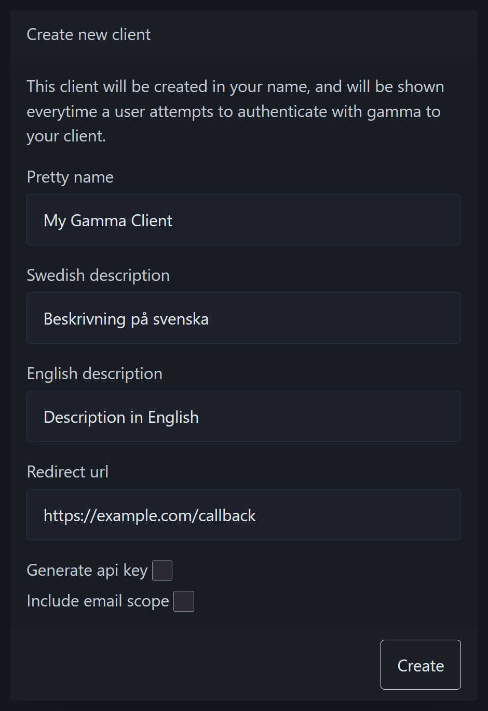

# Website

When working with Gamma, you will have to use the website for some
configuration.

## User Clients

This section describes how to create and manage a
[User Client](./README.md#user-clients).

### Creating a Gamma User Client

> [!IMPORTANT]  
> To create a client you must have a Gamma account, you can register yours
> [here](https://auth.chalmers.it/activate-cid). Detailed instructions can be
> found on [wikIT](https://wiki.chalmers.it/Gamma#HowTo:_Skapa_Gamma-konto).

After creating a Gamma account you can follow these steps to create your
first Gamma client:

1. Login to <https://auth.chalmers.it> with your Gamma account and go to the
   "**Your clients**" menu and click "**Create client**". Or go directly to
   <https://auth.chalmers.it/my-clients/create>.

   

2. Fill in your client details, here is an explanation of the different fields:

   | Field               | Description                                                                                                                                                                                                            |
   |---------------------|------------------------------------------------------------------------------------------------------------------------------------------------------------------------------------------------------------------------|
   | Pretty name         | The name that is shown to your users when authorizing your client. Look at the [authorization page](#the-authorization-page) for reference.                                                                            |
   | Swedish description | A short description in Swedish explaining what your client is for. Appears on the ["**Your accepted clients**"](https://auth.chalmers.it/me/accepted-clients) page for users with Swedish as their preferred language. |
   | English description | A short description in English explaining what your client is for. Appears on the ["**Your accepted clients**"](https://auth.chalmers.it/me/accepted-clients) page for users with English as their preferred language. |
   | Redirect url        | This is the URL that users will be redirected to after authorizing your client as part of the OAuth flow. You can read more about redirect URLs [here](https://www.oauth.com/oauth2-servers/redirect-uris).            |
   | Generate api key    | Whether or not an API key should be created for this client, this cannot be done after creating your client. To figure out if you need this, read the [API keys](#api-keys) section.                                   |
   | Include email scope | Select this option if you need access to the email adress of your users. Read more in the [scopes](#scopes) section.                                                                                                   |

   

### Editing your client

## The Authorization Page

When authorizing a client the user will be presented with the following
information:

- The pretty name of the client.
- A warning if the client is a *User Client*.
- Which data will be made available to the client if authorized.
- The **Deny** button which will redirect the user to the redirect URL of the
  client without authorizing them.
- The **Authorize** button which will authorize the client to access the user's
  data and redirect the user to the redirect URL of the client.

See the screenshot below for an example of an authorization page for a
*User Client*.

