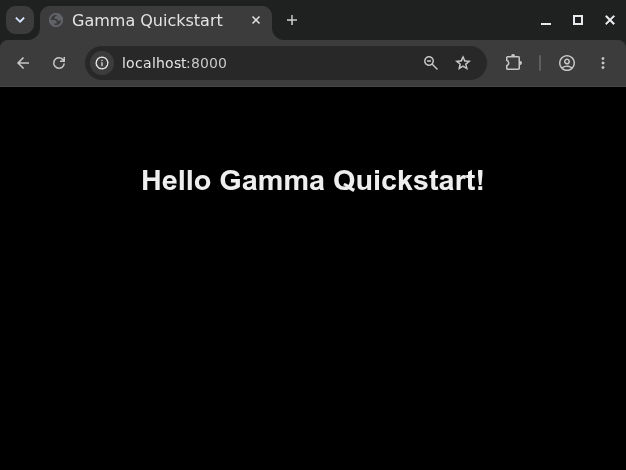
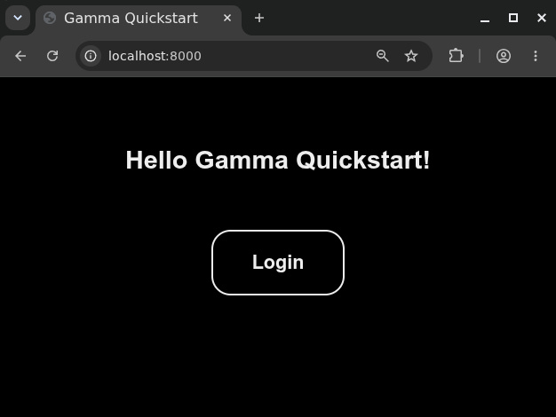
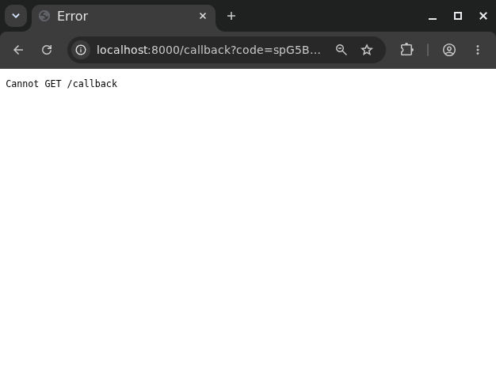
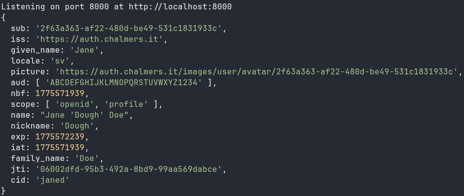

# Quickstart Guide

In this guide, we will build a basic website featuring login with Gamma using
OAuth 2.0 and the [OpenID API](api/openid.md), similar to the
[Gamma Demo](https://github.com/olillin/gamma-demo) created by
[Cal](https://github.com/olillin).

If you have not done so already, follow the guide on
[Creating a User Client](website.md#creating-a-user-client) and use

```
http://localhost:8000/callback
```

as the **Redirect URI**.

[TOC]

## The Authorization Code Flow

"Logging in" to a website with Gamma is actually a form of authorization: You
first authenticate your identity to Gamma by entering your credentials. Then
Gamma will ask if you want to authorize the client, which will allow them to
fetch information about you from the Gamma API.

This is an implemention of the OAuth 2.0 Authorization Code Flow which we will
explore now. To start we will familiarize ourselves with a few OAuth 2.0
concepts:

| Term               | Explanation                                                                                                                                                                                |
| ------------------ | ------------------------------------------------------------------------------------------------------------------------------------------------------------------------------------------ |
| Authorization URI  | Gamma URI where the user can log in and authorize the client. It includes the **Client ID**, **Redirect URI** and **Scopes** which are needed for Gamma to correctly authorize the client. |
| Client Id          | Public identifier for your client.                                                                                                                                                         |
| Client Secret      | Secret key which your client uses to authenticate itself. **Anyone with the secret can impersonate your client.**                                                                          |
| Redirect URI       | URI on your server where the user is redirected after approving or denying your client.                                                                                                    |
| Scopes             | The types of information the client wants to access about the user. Read more on the [Authorization](api/authorization.md#scopes) page.<br>                                                |
| Authorization Code | Acquired after the user approves the client on the login screen. Is sent to Gamma to be exchanged for an **Access Token** by your client.                                                  |
| Access Token       | A secret token used by the client to authorize Gamma API requests.                                                                                                                         |

Got all that? Great! The authorization flow we will implement looks like this:

1. The user presses the login button on your website. This causes the browser to
    ask your backend client to authorize by redirecting to `/authorize`.
2. Your client tells the browser to redirect to the **Authorization URI**
    containing your client details.
3. The user is presented with the Gamma login and consent screens where the user
    can see what information your client will be able to access and may approve
    or deny authorizing it.
4. After approving or denying your client Gamma will tell the browser to
    redirect to the **Redirect URI** on your website. Assuming the client is
    approved an **Authorization Code** will be included in the `code` query
    parameter.
5. Your client sends the authorization code to Gamma together with the client
    credentials.
6. Gamma responds with an **Access Token**, which is used to access the API.
    Hooray!


/// caption
Diagram of the Authorization Code Flow in Gamma.
///

Read more about authorizing with the Gamma API on the dedicated
[Authorization](api/authorization.md) page.

## Follow Along

It is recommended that you practice implementing the flow yourself while
following this guide. To get the starting template you can clone the Git
repository at <https://github.com/olillin/gamma-quickstart>:

```console
git clone https://github.com/olillin/gamma-quickstart
```

We will be building the website with Node.js® which you can get from the
[official downloads page](https://nodejs.org/en/download) or if you are using
[Nix](https://nixos.org), just run `nix develop` in the folder.

Then run this command in your terminal to install all dependencies:

```console
npm install -D
```

You will also need a Gamma client, follow the instructions at
[Creating a User Client](website.md#creating-a-user-client) and make sure the
**Redirect URI** is `http://localhost:8000/callback` and that *Generate api key*
is checked.

Then you can open the `.env` file and paste the `CLIENT_ID` and `CLIENT_SECRET`
with their respective values. The `API_KEY_TOKEN` is shown as "Api key" below
the client secret, the `API_KEY_ID` is found between `pre-shared` and `:` in the
generated `Authorization` header.

To start a development server run this command in your terminal:

```console
npm run dev
```

Now go to <http://localhost:8000>. You should see a mostly empty page with a
"Hello Gamma Quickstart!" in the middle, this is the page we will be adding
login to.



!!! tip

    **Keep the terminal open** and the website will reload automatically when you
    update the source code.

## Starting Point

The files included in the repository look like this:

```
gamma-quickstart/
├── package.json
├── package-lock.json
├── README.md
├── src
│   ├── app.ts
│   ├── home.hbs
│   ├── layouts
│   │   └── main.hbs
│   ├── public
│   │   └── styles.css
│   └── setup
│       └── index.ts
└── tsconfig.json
```

In an attempt to keep this guide framework-agnostic we will be using a simple
stack with [TypeScript](https://www.typescriptlang.org),
[Express.js](https://expressjs.com) and [Handlebars](https://handlebarsjs.com)
templates (`.hbs`). How Express and Handlebars work together is explained below,
if you are already familiar with this you may skip to
[Adding Login](#adding-login).

Let's look at how the homepage is rendered in `app.ts`:

```typescript title="src/app.ts"
app.get('/', (req, res) => {
    res.render('home')
})
```

`app` is the Express router which handles all requests to our website. `.get()`
creates a new request handler for the HTTP `GET` method, and there are
corresponding methods for other HTTP methods like `POST` or `DELETE`. The string
`'/'` is the URI path which we want to handle requests for. We then define a
*handler function* with two parameters: `req` is the incoming *request* and
allows us to get parameters like our future authorization code. `res` is the
*response* and has methods which define which data is sent back.

This handler is very simple and only contains a single statement renders the
template called "home", found in `src/home.hbs`:

```html title="src/home.hbs"
<h1>Hello Gamma Quickstart!</h1>
```

Currently our template is not making use of Handlebars as it has no expressions.
Let's replace "Gamma Quickstart" with an expression:

```html title="src/home.hbs"
<h1>Hello {{name}}!</h1>
```

Now when `home.hbs` is rendered `{{name}}` will be replaced with the value
`name` in the *context*. The context is an object provided as another parameter
of the `.render()` method:

```typescript
res.render('home', { name: 'Handlebars' })
```

When the page is reloaded the homepage should now say "Hello Handlebars!". This
is how we will display information from the server to the user of the website.

## Adding Login

To initate the login we will create a new route at `/authorize` which will
create the **Authorization URI** and redirect the user. Edit the home in
`home.hbs` page and add the button:

```html title="src/home.hbs"
  <h1>Hello Gamma Quickstart!</h1>
{+++ <a href="/authorize">Login</a>++}
```



To communicate with Gamma we will use the [gammait](https://npmx.dev/gammait)
library, a Gamma API Client for Node.js®. Code examples using
[openid-client](https://npmx.dev/openid-client) are provided as a reference for
implementations in other languages without a Gamma client.

First we will create a client for the **Authorization Code Flow**, providing our
client details and credentials. We will use the methods on this client to
interact with the Gamma API.

=== "gammait"

    ```typescript title="src/app.ts"
    import { AuthorizationCode } from 'gammait'

    const clientId = process.env.CLIENT_ID
    const clientSecret = process.env.CLIENT_SECRET
    const redirectUri = process.env.REDIRECT_URI

    const client = new AuthorizationCode({
        clientId: clientId,
        clientSecret: clientSecret,
        redirectUri: redirectUri,
        scope: ["openid", "profile"]
    })
    ```

=== "openid-client"

    ```typescript title="src/app.ts"
    import * as client from 'openid-client'

    const server = new URL("https://auth.chalmers.it")
    const clientId = process.env.CLIENT_ID
    const clientSecret = process.env.CLIENT_SECRET
    const redirectUri = process.env.REDIRECT_URI

    const config: client.Configuration = await client.discovery(
        server,
        clientId,
        clientSecret,
    )
    ```

Then we will create the route `/authorize` which will redirect the user to the
**Authorization URI**:

=== "gammait"

    ```typescript title="src/app.ts"
    app.get('/authorize', (req, res) => {
        const authorizationUrl = client.authorizeUrl()

        res.redirect(authorizationUrl)
    })
    ```

=== "openid-client"

    ```typescript title="src/app.ts"
    app.get('/authorize', (req, res) => {
        const authorizationUrl = client.buildAuthorizationUrl(config, {
            redirectUri: redirectUri,
            scope: "openid profile",
        })

        res.redirect(authorizationUrl)
    })
    ```

Return to the homepage and click the login button. You should be able to
authorize your client and be redirected to <http://localhost:8000/callback>,
although the route does not exist yet. Notice the `?code=...` at the end of the
URL, this is the authorization code! The next step is to get an access token.



## Creating the Callback

`// TODO: Explain the process of exchanging the code for a token`

=== "gammait"

    ```typescript title="src/app.ts"
    app.get('/callback', async (req, res) => {
        const code = req.query['code']

        await client.generateToken(String(code))
        const userInfo: UserInfo = await client.userInfo()

        console.log(userInfo)
    })
    ```

=== "openid-client"

    ```typescript title="src/app.ts"
    app.get('/callback', async (req, res) => {
        const code = req.query['code']

        const currentUrl = new URL(req.protocol + '://' + req.get('host') + req.originalUrl)
        const tokens: client.TokenEndpointResponse = await client.authorizationCodeGrant(config, currentUrl)
        const userInfoResponse = await client.fetchProtectedResource(
                config,
                tokens.access_token,
                new URL('https://auth.chalmers.it/oauth2/userinfo'),
                'GET'
                )
        const userInfo = await userInfoResponse.json() as UserInfo

        console.log(userInfo)
    })
    ```

After authorizing the client you should see your user info be printed in the
terminal:



## Creating a Session

Getting the user info is great and all, but if you refresh the callback page you
will get an error. This is because the authorization code can only be used
__once__, so we will need to store the information if we want to access it again
on other pages.

`// TODO: Create session and /user page`

## Handling Failed Login

It is important to consider what will happen if the user does not approve your
client when logging in. In this case the user will still be redirected to the
**Redirect URI** but instead of `code` the URI will have these parameters:

| Name              | Value                                                           |
| ----------------- | --------------------------------------------------------------- |
| error             | access_denied                                                   |
| error_description | OAuth2.0 Parameter: client_id                                   |
| error_uri         | <https://datatracker.ietf.org/doc/html/rfc6749#section-4.1.2.1> |

We can check for `error=access_denied` to detect when a user denied logging in.
Alternatively, we can check for the absence of the `code` parameter.

`// TODO Implementation`

## Using other APIs

Now that the user has logged in to the client we can use their id in requests to
other Gamma APIs. Let's get the groups the user is part of using the
[Client API](api/client-api.md):

```typescript title="src/app.ts"
// ...

import { ClientApi } from 'gammait'

const apiKeyId = process.env.API_KEY_ID
const apiKey = process.env.API_KEY
// TODO: Remove?
const authorization = `pre-shared ${apiKeyId}:${apiKey}`

const clientApi = new ClientApi({
	// TODO: Use real syntax or update gammait
	apiKeyId: apiKeyId,
	apiKey: apiKey
})

app.get('/profile(1)', async (req, res) => {
    // ...
	const profile: UserInfo = await authorizedClient.userInfo()
	
	// Get the user's groups
	const userId: string = profile.sub
	const groups: GroupWithPost[] = await clientApi.getGroupsFor(userId)
	
	// Show the group names and post
	const prettyGroups: string[] = groups.map(group =>
		`${group.prettyName} - ${group.post.enName}`
	)

    // ...
})
```

1. Will be visible at <http://localhost:8000/profile>.

`// TODO`
