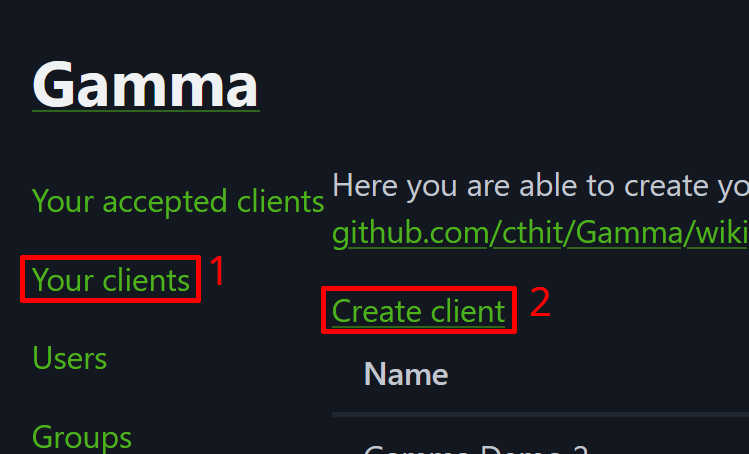
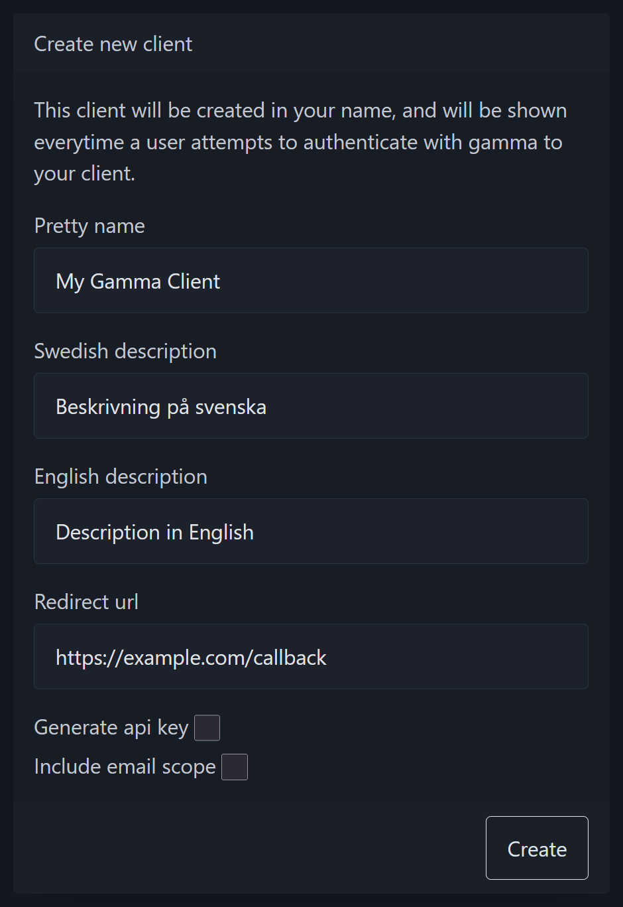
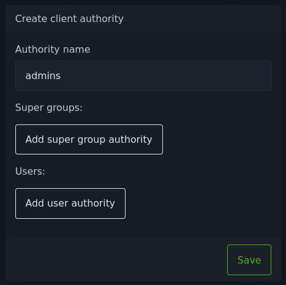
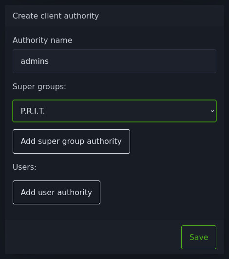
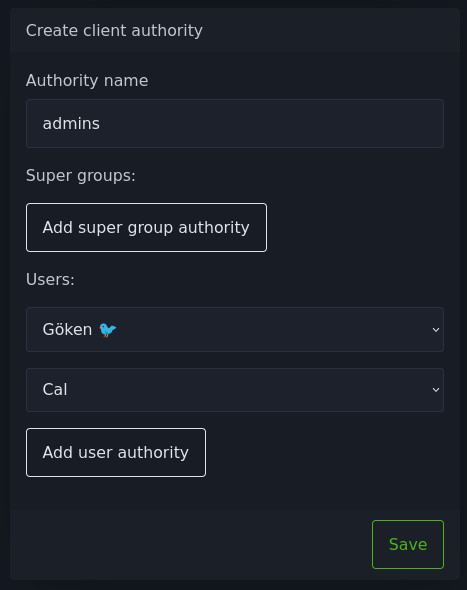
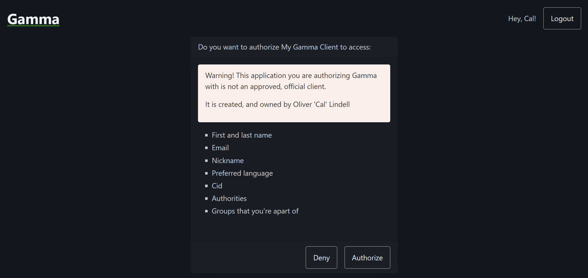
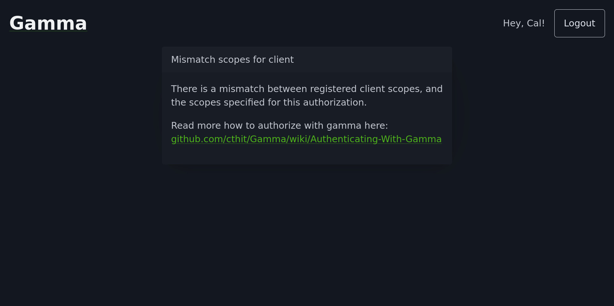

# Website

When working with Gamma, you will have to use the website for some
configuration.

[TOC]

## User Clients

This section describes how to create and manage a
[User Client](index.md#user-clients).

### Creating a Gamma User Client

!!! info

    To create a client you must have a Gamma account, you can register yours
    [on the website](https://auth.chalmers.it/activate-cid). Detailed instructions
    can be found on
    [wikIT](https://wiki.chalmers.it/Gamma#HowTo:_Skapa_Gamma-konto).

After creating a Gamma account you can follow these steps to create your first
Gamma client:

1. Login to <https://auth.chalmers.it> with your Gamma account and go to the
    "**Your clients**" menu and click "**Create client**". Or go directly to
    <https://auth.chalmers.it/my-clients/create>.

    

2. Fill in your client details, here is an explanation of the different fields:

| Field               | Description                                                                                                                                                                                                                                    |
| ------------------- | ---------------------------------------------------------------------------------------------------------------------------------------------------------------------------------------------------------------------------------------------- |
| Pretty name         | The name that is shown to your users when authorizing your client. Look at the [authorization page](#the-authorization-page) for reference.                                                                                                    |
| Swedish description | A short description in Swedish explaining what your client is for. Appears on the ["**Your accepted clients**"](https://auth.chalmers.it/me/accepted-clients) page for users with Swedish as their preferred language.                         |
| English description | A short description in English explaining what your client is for. Appears on the ["**Your accepted clients**"](https://auth.chalmers.it/me/accepted-clients) page for users with English as their preferred language.                         |
| Redirect url        | This is the URL that users will be redirected to after authorizing your client as part of the OAuth flow. You can read more about redirect URLs in [this article by OAuth 2.0 Simplified](https://www.oauth.com/oauth2-servers/redirect-uris). |
| Generate api key    | Whether or not an API key should be created for this client, this cannot be done after creating your client. An API key is required for the [Client Credentials](api/authorization.md#client-credentials-flow) authorization flow.             |
| Include email scope | Select this option if you need access to the email adress of your users. Read more in the [scopes](api/authorization.md#scopes) section.                                                                                                       |

### Editing your client

Editing clients is limited by design to avoid bait-and-switches where a client
disguises itself as something else after authorization[^1]. The only allowed
operations on a client after creation are:

- Resetting the client secret (must be an administrator[^2])
- Resetting the API key (must be an administrator[^3])
- [Creating or deleting client authorities](#creating-client-authorities)
- Deleting the client

#### Creating client authorities

For an introduction to client authorities. See the
[Client Authorities](api/client-api.md#client-authorities) section in the Client
API documentation.

To create a client authority, scroll down to the **Create client authority**
section on the page of your client. There you can fill in the name of the
authority, this is the string which will be returned in the Client API.

!!! note

    Authority names must match this
    [RegEx](https://en.wikipedia.org/wiki/Regular_expression) pattern:
    `/^([0-9a-z]{2,30})$/`[^4].

Then you can add super groups to the authority:

You can also add users to the authority:

## The Authorization Page

When authorizing a client the user will be presented with the following
information:

- The pretty name of the client.
- A warning if the client is a *User Client*.
- Which data will be made available to the client if authorized.
- The **Deny** button which will redirect the user to the redirect URL of the
    client without authorizing them.
- The **Authorize** button which will authorize the client to access the user's
    data and redirect the user to the redirect URL of the client.

See the screenshot below for an example of an authorization page for a *User
Client*.

### Mismatched Scopes

If the requested scopes do not match the registered client scopes the user will
instead see this error screen.

[^1]: Comment by Portals on cthit/Gamma issue #943 on GitHub, *Add ability to edit
    client details* —
    <https://github.com/cthit/Gamma/issues/943#issuecomment-3417938965>

[^2]: cthit/Gamma issue #937 on GitHub, *Unable to reset client secret as
    non-admin user* — <https://github.com/cthit/Gamma/issues/937>

[^3]: cthit/Gamma issue #936 on GitHub, *Unable to reset API key of client as
    non-admin user* — <https://github.com/cthit/Gamma/issues/936>

[^4]: `authorityNamePattern` in `AuthorityName.java`. cthit/Gamma on GitHub —
    <https://github.com/cthit/Gamma/blob/50f8c1e01c9891aa694cade6a325fa2fed80eba8/app/src/main/java/it/chalmers/gamma/app/client/domain/authority/AuthorityName.java#L27>
